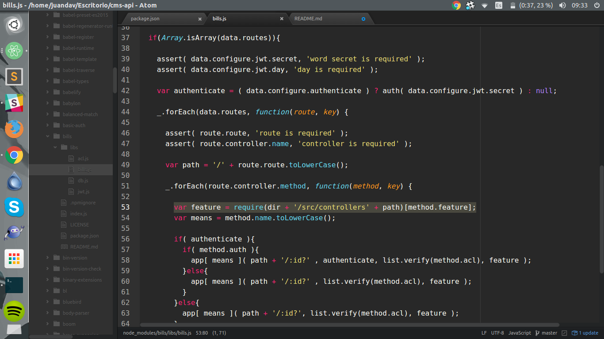
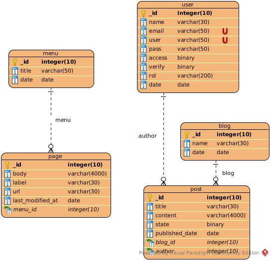

# Bottom-CMS

## Install
  * npm install

## running in developer mode
  1. npm run dev
  2. you can test with "Advance Rest" for api.

## please change the bills module, this line:
  

## The symbolic model database
  

## Introduction

  FORMAT: 1A
  HOST: http://localhost:7000
  VERSIÓN: 1.0

  Welcome to the API documentation system Bottom content manager.

  Bottom API allows you to manage resources within the application Bottom a simple, programmatically using conventional HTTP requests. The endpoints are intuitive and powerful, allowing you to easily make calls to retrieve information or perform actions.

  All the functionality you are familiar with Bottom Control Panel is also available through the API, allowing you to script complex actions that his situation requires.

  The API documentation will start with an overview of the design and technology has been implemented, followed by background information on specific endpoints.

### Requests

  Any tool that is fluent in HTTP can communicate with the API simply by requesting the correct URI. Requests should be made using the HTTPS protocol so that traffic is encrypted. The interface responds to different methods depending on the action required.

### Responses

  When a request is successful, a response body will typically be sent back in the form of a JSON object. An exception to this is when a DELETE request is processed, which will result in a successful HTTP 204 status and an empty response body.

  Inside of this JSON object, the resource root that was the target of the request will be set as the key. This will be the singular form of the word if the request operated on a single object, and the plural form of the word if a collection was processed.


### HTTP Statuses

  Along with the HTTP methods that the API responds to, it will also return standard HTTP statuses, including error codes.

  In the event of a problem, the status will contain the error code, while the body of the response will usually contain additional information about the problem that was encountered.

  In general, if the status returned is in the 200 range, it indicates that the request was fulfilled successfully and that no error was encountered.

  Return codes in the 400 range typically indicate that there was an issue with the request that was sent. Among other things, this could mean that you did not authenticate correctly, that you are requesting an action that you do not have authorization for, that the object you are requesting does not exist, or that your request is malformed.

  If you receive a status in the 500 range, this generally indicates a server-side problem. This means that we are having an issue on our end and cannot fulfill your request currently.

## Routes for api

### Login Route [/login]
  This route allows authenticate to the content management system.

#### Login [POST]
  + Request (application/json)
      + Headers
              Authorization: ABCDEF
      + Body

        ```javascript
        {
           "username": "myUsername",
           "password": "myPassword"
        }
        ```

  + Response 200 (application/json)
    ```javascript
    [
        {
            "status": "success",
            "err": null,
            "data": {
              token: token
            }
        }
    ]
    ```

  + Response 500 (application/json)

    ```javascript
    [
        {
            "status": "error",
            "err":[
                {
                    code: 500,
                    message: "Internal server error"
                }
            ],
            "data": null
        }
    ]
    ```

  + Response 401 (application/json)
    ```javascript
    [
        {
            "status": "fail",
            "err":[
                {
                    code: 401,
                    message: "The user who is trying entered does not exist in our database"
                }
            ],
            "data": null
        }
    ]
    ```

  + Response 401 (application/json)
    ```javascript
    [
        {
            "status": "fail",
            "err":[
                {
                    code: 401,
                    message: "The user has not yet been confirmed with verification code"
                }
            ],
            "data": null
        }
    ]
    ```

  + Response 401 (application/json)

    ```javascript
    [
        {
            "status": "fail",
            "err":[
                {
                    code: 401,
                    message: "The password does not match the specified user"
                }
            ],
            "data": null
        }
    ]
    ```

  + Response 400 (application/json)

    ```javascript
    [
        {
            "status": "fail",
            "err":[
                {
                    code: 400,
                    message: "There are empty fields to sign the petition"
                }
            ],
            "data": null
        }
    ]
    ```
### Account Route [/account]
  route allows the management of accounts in the application

#### Account [GET]

{
"success": true
"status": "success"
"payload": [1]
0:  {
"_id": "56aaa018ea1aaf902083c230"
"name": "Bottom"
"user": "admin"
"pass": "admin"
"__v": 0
"date": "2016-01-28T23:09:32.167Z"
"rol": [1]
0:  "Visitor"
-
"verify": true
"access": true
"email": [1]
0:  "e.juandav@gmail.com"
-
}-
-
"error": {}
}

### Menu Route [/menu]
  allows to manage the menu

#### Menu [GET]

{
"success": true
"status": "success"
"payload": [4]
0:  {
"_id": "56bd5b7b0e89a15f40035a2f"
"title": "test3"
"__v": 0
"date": "2016-02-12T02:09:25.364Z"
}-
1:  {
"_id": "56bd5bdc0e89a15f40035a30"
"title": "n ,m m,"
"__v": 0
"date": "2016-02-12T02:09:25.364Z"
}-
2:  {
"_id": "56be51e37c7cb16748518b6d"
"title": "test ahora"
"__v": 0
"date": "2016-02-12T21:40:59.597Z"
}-
3:  {
"_id": "56be52897c7cb16748518b6e"
"title": "dadadadadada"
"__v": 0
"date": "2016-02-12T21:40:59.597Z"
}-
-
"error": {}
}

### Page Route [/page]
  allows to manage the page

#### Page [GET]

{
"success": true
"status": "success"
"payload": [1]
0:  {
"_id": "5699349932541788300e103f"
"body": "test2"
"label": "test2"
"url": "test2"
"menu_id": null
"__v": 0
"last_modified_at": "2016-01-15T18:05:08.361Z"
}-
-
"error": {}
}

### Blog Route [/blog]
  allows to manage the blog

#### Blog [GET]

{
"success": true
"status": "success"
"payload": [3]
0:  {
"_id": "56947dbaae851a3a16e67df2"
"__v": 0
"date": "2016-01-12T04:14:33.442Z"
}-
1:  {
"_id": "56a88a59f91a5bfe6c71a6a6"
"__v": 0
"date": "2016-01-27T09:13:53.984Z"
}-
2:  {
"_id": "56a88aaef91a5bfe6c71a6a7"
"__v": 0
"date": "2016-01-27T09:13:53.984Z"
}-
-
"error": {}
}

### Post Route [/post]
  allows to manage the post

#### Post [GET]

{
"success": true
"status": "success"
"payload": [0]
"error": {}
}
